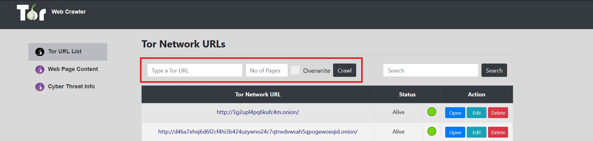
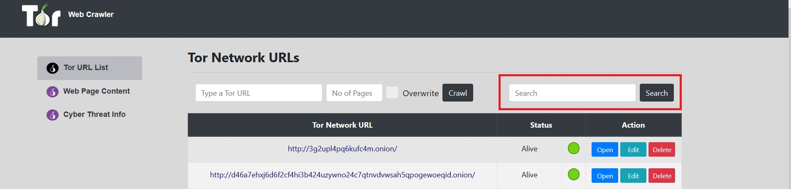
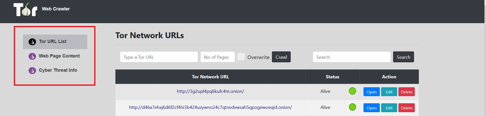
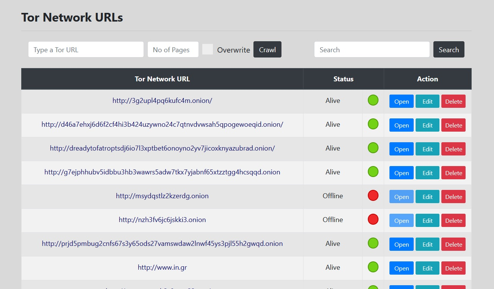
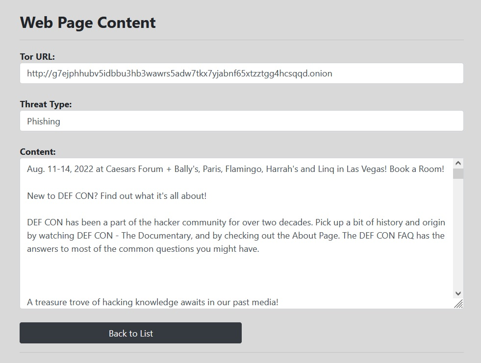

# Tor-network-web-crawler

This is a Java version of the <a href="https://github.com/ioannis-toumpoglou/tor-web-crawler">application</a> that was developed for my Master's degree thesis in 2019.

It is a web crawler capable of collecting data from webpages that belong to the Tor network, also known as hidden services. 
Both the entire HTML code and the extracted text of each page are stored in an SQL database for further processing. 

The application uses MySQL database in the backend and a user named **dbuser** is required. 
In order to create this user, the following commands should be executed, using either **MySQL Workbench**
or **MySQL shell**:

1. CREATE USER 'dbuser'@'localhost' IDENTIFIED BY 'dbuser';
2. GRANT ALL PRIVILEGES ON * . * TO 'dbuser'@'localhost';
3. FLUSH PRIVILEGES;
  

For the application to connect to the Tor Network, it is necessary to have the **Tor browser** 
open at the same time. 
To download the Tor browser, please use this <a href="https://www.torproject.org/download/">link</a>.

An unsupervised machine learing algorithm is used in order to classify the extracted text, based on the cyber-threat type it refers to. It is implemented in Python and the script is called and executed via the Spring Boot main app, right after the page's text is stored in the database.

The machine learning algorithm used is <b>K-Means</b>.

The user has the option to crawl a single webpage by typing the URL of that page in the field at the top of the page. The option to crawl multiple pages is also provided, simply by typing the URL and the number of pages desired. In this case, the crawler uses the URL as a seed, extracts the URLs included in this page and randomly selects, crawls and collects the data from pages until the number defined has been reached.
  

	
	  
	<b>Image 1 - URL address bar and page number</b>

  

The search bar on the top right of the screen is used to search among crawled pages using keywords.
  

	
	  
	<b>Image 2 - Search bar</b>

  

On the left side of the screen there are three options, which offer the capability to move around in the application. 
<li>The <b>Tor URL List</b> of the web pages that have been crawled. 
<li>The <b>Web Page Content</b> page, where one may find the extracted text of these pages. 
<li>The <b>Cyber Threat Info</b>, where the user may manually store information about Cyber Threats.
  

	
	  
	<b>Image 3 - Navigation options</b>

  

The main page includes the <b>Tor URL List</b>, the list of the web pages that have been crawled. The list contains the full URL, the status of the web page at the time it was crawled, meaning whether it was active or inactive and a set of managing options (open, edit and delete). Because of the hidden nature of the Tor network, it is very usual for pages to have a short lifespan and to be inactive after a while.
  

	
	  
	<b>Image 4 - Tor URL List</b>

  

By selecting the <b>Edit</b> option next to a URL, the user has access to that specific page's details, meaning the URL, the page status and the extracted text. With the button at the bottom of the page the user returns to the main page.
  

	
	  
	<b>Image 5 - Web page edit</b>

  